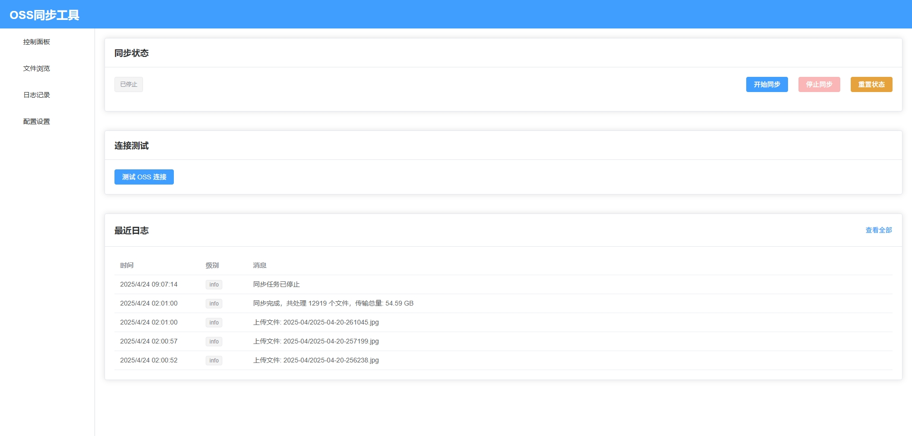

# OSS同步工具

一个用于同步本地文件到阿里云OSS的现代化网页应用。通过简单易用的UI界面，轻松管理和监控文件同步进度，支持增量同步和忽略重复文件。



## 功能特点

- 同步本地文件到阿里云OSS
- 支持增量同步，避免重复上传相同文件
- 忽略重复文件，节省上传流量和存储空间
- 实时网速监控和传输状态显示
- 现代化网页界面
  - 开始/停止同步
  - 显示最近100条日志
  - 设置定时任务
  - 实时测试OSS连接
  - 查看映射宿主机文件路径内容
- 使用Docker容器在Python 3.10环境下运行
- 通过docker-compose配置OSS参数和映射宿主机文件路径
- 网络传输状态监控，包括：
  - 当前上传速度
  - 平均上传速度
  - 总传输数据量
  - 预计剩余时间

## 技术栈

- 后端：Python 3.10 + Flask
- 前端：Vue.js 3 + Element Plus
- 存储：阿里云OSS (使用oss2库)
- 容器化：Docker + docker-compose

## 快速开始

### 准备工作

确保您的系统已安装：
- Docker
- docker-compose

### 安装步骤

1. 克隆项目
```bash
git clone https://github.com/hang1233/aliOSS-Sync.git
cd aliOSS-Sync
```

2. 创建并编辑.env文件（参考.env-example）
```bash
cp .env-example .env
# 编辑.env文件，填入您的OSS配置和本地文件路径
```

3. 启动应用
```bash
docker-compose up -d
```

4. 访问应用
```
http://localhost:2003
```

## 配置说明

### 环境变量

在.env文件中配置以下环境变量：

```
# OSS 配置
OSS_ACCESS_KEY_ID=your_access_key_id
OSS_ACCESS_KEY_SECRET=your_access_key_secret
OSS_BUCKET=your_bucket_name
OSS_ENDPOINT=http://oss-cn-region.aliyuncs.com

# 宿主机路径映射
HOST_PATH=/path/to/your/files
```

> **注意**：请勿将包含您实际密钥的.env文件提交到公共仓库中。

### 配置界面

应用提供了Web界面进行以下配置：

- **同步设置**：可以设置文件忽略模式，如.git/、*.tmp等
- **定时任务**：可以设置自动同步的时间间隔
- **连接测试**：可以测试OSS连接是否正常

## 使用指南

### 同步文件

1. 在Web界面中，导航到"控制面板"
2. 点击"开始同步"按钮开始同步文件
3. 实时查看同步进度、网速和剩余时间
4. 如需停止同步，点击"停止同步"按钮

### 查看文件

1. 在Web界面中，导航到"文件浏览"
2. 浏览宿主机上映射的文件和目录
3. 点击文件/文件夹进行导航

### 查看日志

1. 在Web界面中，导航到"日志记录"
2. 查看最近的同步操作日志，包括成功和错误信息

## 开发指南

### 项目结构

```
aliOSS-Sync/
├── app.py                # 主应用程序
├── requirements.txt      # Python依赖
├── Dockerfile            # Docker构建文件
├── docker-compose.yml    # Docker Compose配置
├── .env-example          # 环境变量示例
├── frontend/             # 前端代码
│   ├── src/              # 源代码
│   │   ├── views/        # 页面组件
│   │   ├── router/       # 路由配置
│   │   └── App.vue       # 主应用组件
│   ├── package.json      # npm配置
│   └── vite.config.js    # Vite配置
└── data/                 # 数据存储目录（运行时创建）
```

### 自定义开发

1. 修改后端代码（app.py）
2. 修改前端代码（frontend/src/）
3. 重新构建并启动容器
```bash
docker-compose down
docker-compose up -d --build
```

## 常见问题

### Q: 同步过程中出现错误，如何处理？
A: 在控制面板上点击"重置状态"按钮，然后重新开始同步。

### Q: 如何确认OSS连接成功？
A: 在控制面板上点击"测试OSS连接"按钮进行测试。

### Q: 如何修改同步的文件路径？
A: 修改.env文件中的HOST_PATH路径，然后重启容器。

## 贡献指南

欢迎为本项目做出贡献！请按以下步骤操作：

1. Fork本仓库
2. 创建您的特性分支 (`git checkout -b feature/amazing-feature`)
3. 提交您的更改 (`git commit -m '添加一些功能'`)
4. 推送到分支 (`git push origin feature/amazing-feature`)
5. 创建Pull Request

## 许可证

本项目基于MIT许可证发布 - 详情请查看 [LICENSE](LICENSE) 文件。

## 致谢

- [阿里云OSS](https://www.aliyun.com/product/oss) - 对象存储服务
- [Flask](https://flask.palletsprojects.com/) - Python Web框架
- [Vue.js](https://vuejs.org/) - 前端框架
- [Element Plus](https://element-plus.org/) - UI组件库 